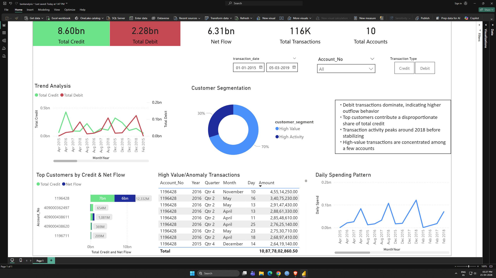

# Banking Data Analysis Project

## 📊 Overview

This project analyzes banking transaction data to uncover customer behavior, transaction trends, and potential anomalies.

## 🛠 Tools Used

* SQL Server (Data Cleaning & Analysis)
* Power BI (Dashboard & Visualization)
* Excel (Initial exploration)

## 📁 Dataset

* 100K+ transaction records
* Includes account details, deposits, withdrawals, and balances

## 🔍 Key Analysis

* Total Credit, Debit, and Net Flow
* Customer Segmentation (High Value, High Activity)
* Daily Spending Patterns
* High-Value Transaction Detection
* Top Customer Identification

## 📊 Dashboard

## 💡 Key Insights

* Debit transactions dominate, indicating higher spending behavior
* Top customers contribute a major portion of total credit
* Transaction activity peaked around 2018
* High-value transactions are concentrated among a few accounts

## 🚀 Learnings

* Data cleaning and transformation using SQL
* Writing analytical queries and using window functions
* Building interactive dashboards in Power BI
* Applying business thinking to data

## 📌 Future Improvements

* Add real-time data pipeline
* Implement advanced anomaly detection
* Improve dashboard interactivity

---
